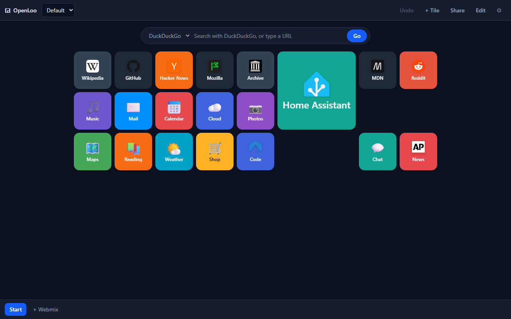

# OpenLoo

A self-hosted visual bookmark dashboard — a grid of colourful tiles you can use
as your browser's start page. An open alternative to Symbaloo, with no account,
no tracking, and no server holding your links.



**[Try the live demo →](https://baconwappedbitcoin.github.io/openloo/)** — it runs
entirely in your browser. Any boards you make there are stored only on your own
device; nothing is uploaded, and no one else can see them.

## What it is

OpenLoo runs two ways from one codebase:

- **Local (default).** A static web app with no backend. Your bookmarks live in
  the browser's local storage and never leave the device unless you export them.
  This is what the [live demo](https://baconwappedbitcoin.github.io/openloo/) and
  any static host (GitHub Pages, Netlify, an S3 bucket) give you. The trade-off:
  **data is per-browser** — it does not follow you to another device, and
  clearing site data deletes it.

- **Synced (opt-in, self-hosted).** Run it with the included sync server and one
  dashboard follows you across every device and browser, unlocked by a single
  passcode. See [Sync across your devices](#sync-across-your-devices).

The app detects which mode it is in at runtime: if a sync server answers, it
uses it; otherwise it stays local. Same build, either way.

## Features

- **Grid of tiles** — 1×1 up to 3×2, drag to rearrange, arrow keys to nudge
- **Tile icons** — the site's real favicon, a curated set of ready-made icons
  to pick from, any emoji, or an image you upload
- **Multiple Openmixes** — each Openmix is a page of tiles, switched via the
  tab bar at the top; move a tile between them by dragging it onto a tab
- **Local profiles** — separate sets of Openmixes in one browser (work, home, kids)
- **Search bar** — DuckDuckGo, Startpage, Brave, Google, Bing, Ecosia, Wikipedia,
  YouTube, or your own `%s` template; typing a bare domain goes straight there
- **Cross-device sync (optional)** — self-host with the sync server and your
  boards follow you everywhere, behind one passcode
- **Share by link** — the whole board is packed into the URL, so there is
  nothing to host
- **Import / export** — plain JSON, for backups and moving between browsers
- **Light and dark** — follows your system by default
- **Undo** — `Ctrl`/`Cmd`+`Z` for every destructive action
- **No third-party requests by default** — see [Privacy](#privacy)

### Keyboard shortcuts

| Key | Action |
| --- | --- |
| `/` | Focus the search bar |
| `E` | Toggle edit mode |
| `N` | Add a tile |
| `Ctrl`/`Cmd` + `Z` | Undo |
| Arrow keys | Move the focused tile (in edit mode) |
| `Esc` | Close a dialog |

## Run it

### Docker (recommended for self-hosting)

This brings up two containers — the web frontend and the sync server — with
cross-device sync enabled:

```bash
docker compose up -d
```

Then open <http://localhost:8086>. On first launch it shows a **Create passcode**
screen; set one and you are in. Boards then sync to every device that unlocks
with it. (Prefer to set the passcode up front instead? `cp .env.example .env`
and set `OPENLOO_PASSCODE` before starting — then first launch goes straight to
the unlock screen.)

Both containers run non-root with a read-only root filesystem, all Linux
capabilities dropped, and a restrictive Content-Security-Policy. The sync server
is **not** published to the host — only the frontend reaches it, over the
internal Docker network. Your data lives in the `openloo-data` volume.

The host port defaults to **8086** (8080 is so commonly already in use). Change
the left-hand number of the `ports` mapping in `docker-compose.yml` to serve it
elsewhere; nginx always listens on 8080 inside the container.

> Serving over the internet? Put it behind a reverse proxy with HTTPS (the
> passcode and boards travel in plain HTTP otherwise). On a LAN or a Tailnet,
> plain HTTP is usually fine.

### Static files

Any static host will do — there is nothing to configure.

```bash
npm ci && npm run build
```

Serve the contents of `dist/`. If you are hosting under a subpath, set the base
path at build time:

```bash
BASE_PATH=/openloo/ npm run build
```

### Host your own copy on GitHub Pages (free, no server)

You can host your own OpenLoo on GitHub Pages in a couple of minutes — no
server, no cost. This gives you the local, browser-only build (no cross-device
sync; for that, self-host with Docker as above).

1. **Fork this repository** to your own account (top-right **Fork** button).
2. In your fork, open **Settings → Pages** and set **Source** to
   **GitHub Actions**.
3. That's it. The included workflow (`.github/workflows/pages.yml`) builds and
   deploys on every push to `main`, and again whenever you enable Pages. When it
   finishes (watch the **Actions** tab), your dashboard is live at:

   ```
   https://<your-username>.github.io/<repo-name>/
   ```

The workflow sets the base path automatically from the repository name and adds
a `404.html` fallback so deep links work. To update later, just push to `main`
(or edit files right on GitHub) and it redeploys.

> The public demo has extra sample content switched on via a `VITE_DEMO=1` build
> flag. Your fork builds **without** it, so you start from a clean, privacy-first
> board (no favicon requests until you turn a provider on). To seed the demo
> content in your own build, set `VITE_DEMO: '1'` in the workflow's build step.

### Development

```bash
npm ci && npm run dev
```

| Command | What it does |
| --- | --- |
| `npm run dev` | Dev server on <http://localhost:5173> |
| `npm run build` | Production build into `dist/` |
| `npm test` | Unit tests |
| `npm run typecheck` | TypeScript, no emit |

## Privacy

Self-hosting a dashboard that quietly phoned home would defeat the point, so:

- **Favicon fetching is off by default.** Asking DuckDuckGo or Google for a
  site's icon tells them which sites you have bookmarked. With the default
  setting of `None`, OpenLoo makes **no third-party requests at all** — tiles
  fall back to initials, a ready-made icon, an emoji, or an image you upload.
  Choosing the "Favicon" icon while it is off shows the trade-off inline and
  lets you enable it in one click, so the choice is informed rather than buried.
- **Share links contain the board itself**, in the URL fragment. Fragments are
  never sent to a server, so even the host serving the app does not see what
  you shared.
- **No analytics, no telemetry, no fonts or scripts from a CDN.** The bundle is
  entirely self-contained.
- **In synced mode, your boards live only on your own server** and are reached
  same-origin at `/api`. There is no OpenLoo cloud and nothing is sent to any
  third party — sync talks to the server you run and nothing else.

### Handling untrusted boards

A shared link or an imported file is data from someone else, and OpenLoo treats
it that way:

- Every URL is validated; `javascript:`, `data:text/html`, `file:` and friends
  are dropped rather than rendered as clickable tiles.
- Uploaded and linked icons must be raster images. SVG data URIs are rejected
  because SVG can carry script.
- Control characters and Unicode bidi overrides are stripped from titles, so a
  tile cannot be made to display something other than what is stored.
- Geometry is clamped and overlaps resolved, so a malformed board cannot break
  the grid.
- Incoming shared boards are **previewed with their destination hostnames
  listed** before you accept them — a tile labelled "Bank" can point anywhere,
  and that is the moment to notice.

Unknown fields are discarded rather than passed through. See
[`src/lib/sanitize.ts`](src/lib/sanitize.ts) and the tests in
[`tests/sanitize.test.ts`](tests/sanitize.test.ts).

## Sync across your devices

The default local mode keeps boards in one browser. Self-host with the sync
server and a single dashboard follows you everywhere instead.

**How it works.** The `docker compose` stack runs a tiny sync server alongside
the frontend. It holds **one** dashboard document guarded by **one** passcode —
there are no accounts, matching "my dashboard, on all my devices" rather than
"a service for many users". Every device that enters the passcode reads and
writes the same document; changes made on one appear on the others.

**Signing in.** On a fresh instance the first visitor sets the passcode through
a **Create passcode** screen (or you can set `OPENLOO_PASSCODE` in `.env` up
front). Until a passcode exists the sync store refuses all data access, so a
fresh instance is never briefly readable — set it promptly on a reachable
network. After that, each device asks for the passcode once. It is the whole
login — pick something long. There is a short lockout after repeated wrong
guesses, the passcode is only ever compared as a salted hash in constant time,
and the plaintext is never written to disk.

**Concurrency.** Each save carries a revision number; if another device saved
first, the write is rejected and the newer version is loaded rather than being
silently overwritten. So two devices editing at once cannot clobber each other.

**Design.** This did not require rewriting the app. All persistence goes through
one `StorageAdapter` interface ([`src/storage/adapter.ts`](src/storage/adapter.ts));
the local and remote backends are two implementations, and
[`src/storage/index.ts`](src/storage/index.ts) probes `/api/health` at runtime to
pick between them. The sync server itself
([`server/index.mjs`](server/index.mjs)) is dependency-free Node.

## Architecture

```
src/
  types.ts          Data model — no React, no DOM
  lib/              Pure logic: grid math, sanitising, sharing, URLs, colours
  storage/          StorageAdapter interface, local + remote implementations
  store/            Zustand store, undo history, debounced persistence
  hooks/            Board measurement
  components/       UI
server/             Dependency-free Node sync server (single-document store)
tests/              Unit tests for the grid and the trust boundary
```

The interesting parts are `lib/grid.ts` (placement, swapping, reflow) and
`lib/sanitize.ts` (the trust boundary). Both are pure functions and both are
tested.

## Contributing

Issues and pull requests are welcome. Please keep `npm test` and `npx tsc -b`
green — CI runs both on every push.

## Licence

[MIT](LICENSE).

Not affiliated with, endorsed by, or derived from Symbaloo. "Symbaloo" is a
trademark of its respective owner; it is referenced here only to describe what
kind of tool this is.
